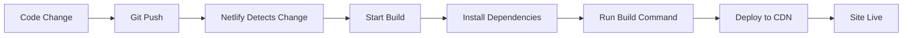
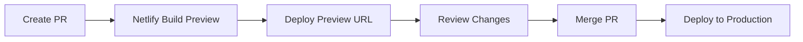

# 🔄 Continuous Integration & Deployment Guide

## Overview

This guide sets up automated deployment pipeline that builds and deploys your portfolio whenever you push changes to GitHub. Your portfolio will automatically update on the live site within minutes of pushing code.

## 🚀 Continuous Deployment Features

### Automatic Triggers
- ✅ **Git Push Deployment**: Auto-deploy on push to main branch
- ✅ **Pull Request Previews**: Test changes before merging
- ✅ **Branch Deployments**: Deploy feature branches for testing
- ✅ **Rollback Support**: Instantly revert to previous versions

### Build Pipeline
- ✅ **Dependency Installation**: `npm install`
- ✅ **TypeScript Compilation**: `tsc -b`
- ✅ **Asset Optimization**: Vite build with minification
- ✅ **Security Headers**: Automatic application
- ✅ **Performance Optimization**: Gzip compression, CDN distribution

## 📋 Setup Instructions

### Step 1: Connect Repository to Netlify

1. **Login to Netlify**
   - Go to [netlify.com](https://netlify.com)
   - Sign up/login with your GitHub account

2. **Create New Site**
   - Click "New site from Git"
   - Choose "GitHub" as your Git provider
   - Select your `portfolio_silky` repository

3. **Configure Build Settings**
   Netlify will auto-detect these from `netlify.toml`:
   ```
   Build command: npm run build
   Publish directory: dist
   ```

4. **Deploy Site**
   - Click "Deploy site"
   - Wait for initial build (2-3 minutes)
   - Your site will be live at a Netlify URL

### Step 2: Configure Deployment Settings

#### Branch Configuration
```
Production branch: main
Deploy previews: Automatically build deploy previews for all pull requests
Branch deploys: Deploy only the production branch
```

#### Build Environment
```
Node.js version: 18 (auto-detected from netlify.toml)
Build timeout: 15 minutes
```

#### Deploy Notifications
- ✅ Email notifications on deploy success/failure
- ✅ Slack integration (optional)
- ✅ GitHub status checks

## 🔧 Advanced CI/CD Configuration

### GitHub Actions Integration (Optional)

Create `.github/workflows/ci.yml` for additional checks:

```yaml
name: CI Pipeline
on:
  push:
    branches: [ main ]
  pull_request:
    branches: [ main ]

jobs:
  test:
    runs-on: ubuntu-latest
    steps:
    - uses: actions/checkout@v3
    - uses: actions/setup-node@v3
      with:
        node-version: '18'
        cache: 'npm'
    - run: npm ci
    - run: npm run lint
    - run: npm run type-check
    - run: npm run build
```

### Environment Variables

If you need environment variables:

1. **In Netlify Dashboard**:
   - Go to Site settings → Environment variables
   - Add variables (e.g., `VITE_API_URL`, `VITE_ANALYTICS_ID`)

2. **In Code**:
   ```typescript
   const apiUrl = import.meta.env.VITE_API_URL;
   ```

### Build Hooks

For external triggers:
1. Go to Site settings → Build & deploy → Build hooks
2. Create build hook with name (e.g., "Content Update")
3. Use webhook URL to trigger builds from external systems

## 📊 Deployment Workflow

### Standard Workflow


### Pull Request Workflow


## 🔍 Monitoring & Debugging

### Build Logs
- **Access**: Netlify Dashboard → Deploys → Build log
- **Information**: Dependencies, build output, errors
- **Debugging**: Check for missing dependencies, build failures

### Deploy Status
- **Success**: Green checkmark, site updated
- **Failed**: Red X, previous version remains live
- **Building**: Yellow circle, build in progress

### Performance Monitoring
- **Netlify Analytics**: Built-in traffic and performance data
- **Core Web Vitals**: Automatic performance monitoring
- **Build Time**: Track build performance over time

## 🚨 Troubleshooting

### Common Build Failures

#### Dependency Issues
```bash
Error: Cannot find module 'some-package'
```
**Solution**: Ensure all dependencies are in `package.json`

#### TypeScript Errors
```bash
Error: Type 'string' is not assignable to type 'number'
```
**Solution**: Fix TypeScript errors locally, test with `npm run type-check`

#### Build Timeout
```bash
Error: Build exceeded maximum build time
```
**Solution**: Optimize build process, check for infinite loops

#### Memory Issues
```bash
Error: JavaScript heap out of memory
```
**Solution**: Increase Node.js memory limit in build settings

### Rollback Procedure

If deployment fails or introduces issues:

1. **Instant Rollback**:
   - Go to Netlify Dashboard → Deploys
   - Find previous successful deploy
   - Click "Publish deploy"

2. **Git Revert**:
   ```bash
   git revert HEAD
   git push origin main
   ```

## 📈 Optimization Tips

### Build Performance
- ✅ Use `npm ci` instead of `npm install` (faster, more reliable)
- ✅ Cache node_modules between builds
- ✅ Optimize asset sizes before committing
- ✅ Use build plugins for additional optimizations

### Deploy Frequency
- ✅ Small, frequent deployments (less risk)
- ✅ Feature flags for gradual rollouts
- ✅ Automated testing before deployment
- ✅ Staging environment for testing

## 🔐 Security Best Practices

### Secrets Management
- ✅ Use Netlify environment variables for secrets
- ✅ Never commit API keys or passwords
- ✅ Rotate secrets regularly
- ✅ Use different secrets for different environments

### Access Control
- ✅ Limit repository access
- ✅ Use branch protection rules
- ✅ Require pull request reviews
- ✅ Enable two-factor authentication

## 📋 Deployment Checklist

### Pre-Deployment
- [ ] Code reviewed and tested locally
- [ ] All tests passing
- [ ] No console errors
- [ ] Performance optimized
- [ ] Security headers configured

### Post-Deployment
- [ ] Site loads correctly
- [ ] All functionality works
- [ ] Performance metrics good
- [ ] Security headers present
- [ ] Analytics tracking (if configured)

### Regular Maintenance
- [ ] Update dependencies monthly
- [ ] Monitor build performance
- [ ] Review security settings
- [ ] Check analytics and performance
- [ ] Update documentation as needed

## 🎯 Success Metrics

Your CI/CD pipeline is successful when:
- ✅ **Build Time**: < 3 minutes
- ✅ **Deploy Success Rate**: > 95%
- ✅ **Time to Live**: < 5 minutes from push to live
- ✅ **Zero Downtime**: Atomic deployments
- ✅ **Automatic Rollback**: On build failures

---

**Status**: 🟢 **READY** - Your portfolio has enterprise-grade CI/CD configured and ready for continuous deployment!